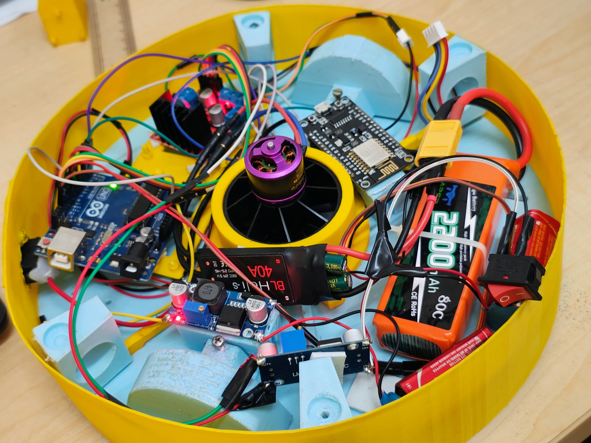

# 🧗‍♂️ Wall Climbing Robot

A wall-climbing robot capable of navigating vertical and inverted surfaces using an EDF (Electric Ducted Fan)-based suction mechanism. This project combines 3D-printed design, Arduino-based control, and wireless communication for robust mobility in complex environments.


## 📌 Project Overview

Applications:
- Industrial inspection
- High-rise maintenance
- Military surveillance
- Hazardous environment exploration

## 🛠️ Hardware Used

| Component                        | Quantity | Specs                          |
|----------------------------------|----------|--------------------------------|
| EDF Ducted Fan                   | 1        | 950g thrust                    |
| ESC                              | 1        | 40A                            |
| LiPo Battery                     | 1        | 3S 11.1V, 2200mAh              |
| Arduino Uno                      | 1        | ATmega328P                     |
| Motor Driver (L298N)             | 1        | Dual H-Bridge                  |
| Micro Motors (Pololu 1000:1)     | 2        | 6V                             |
| Wi-Fi Module (NodeMCU)           | 1        | ESP8266                        |
| Buck Converter                   | 1        | 5V output                      |

## 💻 Software Tools

- SolidWorks (3D design)
- Arduino IDE (programming)
- Processing 4 (GUI)
- ANSYS Fluent (CFD testing)

## 🚀 How to Run

### 1. Upload Arduino Code
Take the arduino codes from the arduino_codes folder and upload it (example)
```bash
src/arduino_code.ino
```
then rune processing code or .exe file 
### 2. Run GUI
```bash
src/processing.pde
```
## 📷 Images

- Check Images folder 

## 📜 License

MIT License

## 🤖 Authors

- Anand Kumar
- Devesh Jha
- Anjali Harikrishnan
- Aditya Choudhary
